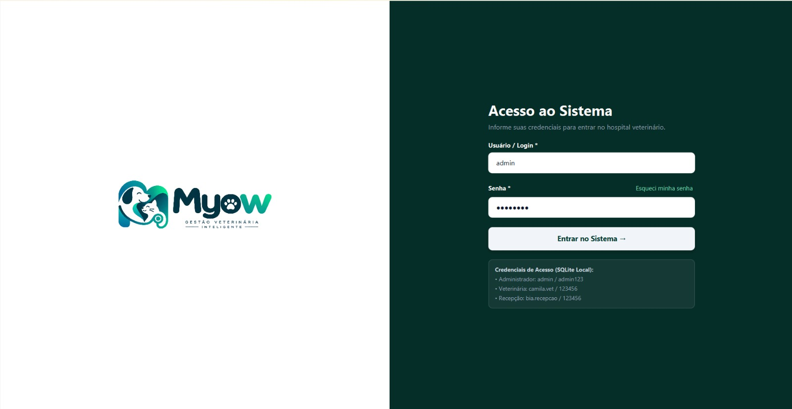
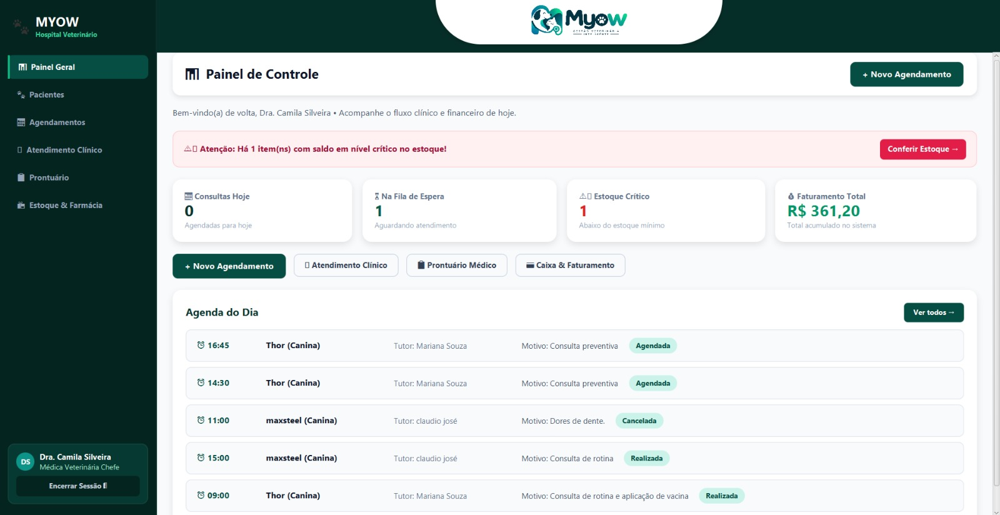
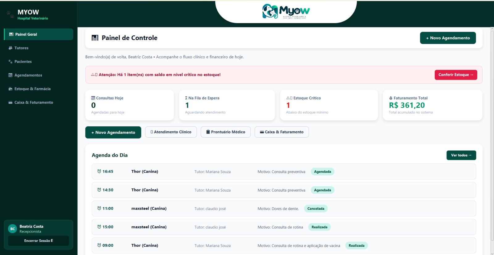
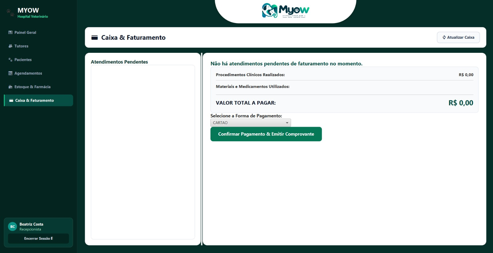

# 🐾 Myow — Gestão Veterinária Inteligente

Sistema desktop para gestão de clínicas e hospitais veterinários, desenvolvido em **Java 17** e **JavaFX**, com persistência local em **SQLite (JDBC)**.

Projeto acadêmico da disciplina de **Engenharia de Software II**.


---

## 📌 Sobre o projeto

O Myow centraliza a rotina de uma clínica veterinária em uma única aplicação. Com ele é possível:

- cadastrar tutores e animais (pacientes);
- agendar, alterar e cancelar consultas;
- registrar atendimentos e consultar o prontuário clínico;
- controlar estoque e medicamentos, com baixa automática durante o atendimento;
- registrar pagamentos e faturamento;
- gerar relatórios, exportáveis em **PDF** e **Excel (.xlsx)**;
- gerenciar funcionários e permissões de acesso.

O sistema roda **100% local**, sem navegador, serviços em nuvem ou APIs externas.

## 🖼️ Telas

| Login | Painel do veterinário |
| :---: | :---: |
|  |  |

| Painel da recepção | Caixa & Faturamento |
| :---: | :---: |
|  |  |

## 🧰 Tecnologias

| Categoria | Tecnologia |
| --- | --- |
| Linguagem | Java 17 |
| Interface | JavaFX 17 |
| Banco de dados | SQLite (`sqlite-jdbc`) |
| Exportação de relatórios | OpenPDF (PDF) e Apache POI (Excel) |
| Build | Maven |
| Testes | JUnit 5 |

## 🏗️ Arquitetura

O projeto segue uma arquitetura em camadas, em que cada camada conversa apenas com a imediatamente abaixo:

```text
JavaFX (view)
     ↓
Services  (regras de negócio e controle de acesso)
     ↓
DAOs      (acesso a dados)
     ↓
SQLite / JDBC
```

| Pacote (`com.myow`) | Responsabilidade |
| --- | --- |
| `model` | Entidades do sistema |
| `view` | Interfaces gráficas em JavaFX |
| `service` | Regras de negócio e controle de acesso |
| `dao` | Acesso ao banco de dados |
| `database` | Gerenciamento da conexão e inicialização do banco |

### Estrutura de pastas

```text
.
├── database/
│   ├── schema.sql      # estrutura das tabelas
│   ├── seed.sql        # dados de demonstração
│   └── myow.db         # banco SQLite local
├── img/                # capturas de tela usadas neste README
├── src/
│   ├── main/java/com/myow/   # código-fonte da aplicação
│   ├── main/resources/       # logo e tema CSS
│   └── test/java/com/myow/   # testes automatizados
└── pom.xml
```

## 🗄️ Banco de dados

O banco fica armazenado localmente em `database/myow.db` e é inicializado a partir de `database/schema.sql` (estrutura) e `database/seed.sql` (dados de demonstração).

**Tabelas (8):** `usuarios`, `tutores`, `pacientes`, `consultas`, `itens_estoque`, `atendimentos`, `atendimento_itens` e `faturamentos`.

## ✅ Funcionalidades

| Código | Caso de uso |
| --- | --- |
| UC01 | Realizar login |
| UC02 | Cadastrar tutor |
| UC03 | Cadastrar paciente |
| UC04 | Agendar consulta |
| UC05 | Alterar consulta |
| UC06 | Cancelar consulta |
| UC07 | Registrar atendimento médico |
| UC08 | Consultar histórico clínico |
| UC09 | Gerenciar estoque e medicamentos |
| UC10 | Registrar pagamento e faturamento |
| UC11 | Gerar relatórios |
| UC12 | Gerenciar funcionários |

**Regras de negócio implementadas:**

- validações de cadastro;
- detecção de conflito de horários no agendamento;
- controle de estoque, com alerta de itens em nível crítico no painel;
- baixa automática de medicamentos durante o atendimento;
- controle de acesso por perfil (RBAC).

## 🔐 Perfis de acesso

O controle de acesso é aplicado **tanto na interface quanto na camada de serviços**. Módulos disponíveis no menu lateral de cada perfil:

| Módulo | Administrador | Veterinário | Funcionário (recepção) |
| --- | :---: | :---: | :---: |
| Painel Geral | ✅ | ✅ | ✅ |
| Pacientes | ✅ | ✅ | ✅ |
| Agendamentos | ✅ | ✅ | ✅ |
| Estoque & Farmácia | ✅ | ✅ | ✅ |
| Tutores | ✅ | — | ✅ |
| Caixa & Faturamento | ✅ | — | ✅ |
| Atendimento Clínico | ✅ | ✅ | — |
| Prontuário | ✅ | ✅ | — |
| Relatórios | ✅ | — | — |
| Equipe & Acessos | ✅ | — | — |

## 🚀 Como executar

### Pré-requisitos

- **JDK 17** ou superior
- **Maven 3.8** ou superior

```bash
java -version
mvn -version
```

### 1. Compilar

```bash
mvn clean compile
```

Resultado esperado: `BUILD SUCCESS`.

### 2. Executar os testes

```bash
mvn test
```

São **10 testes automatizados**, que cobrem: banco de dados, autenticação, recuperação de senha, cadastros, agendamento, estoque, relatórios, RBAC, sessão e geração de IDs.

### 3. Iniciar a aplicação

```bash
mvn javafx:run
```

## 🔑 Credenciais para demonstração

| Perfil | Login | Senha |
| --- | --- | --- |
| Administrador | `admin` | `admin123` |
| Veterinário | `camila.vet` | `123456` |
| Funcionário | `bia.recepcao` | `123456` |

**Recuperação de senha:** a resposta cadastrada para a pergunta de segurança ("Qual o nome da clínica?") é `myow`.

> ⚠️ Essas credenciais existem apenas para demonstração acadêmica. Em um ambiente real, as senhas não devem ser armazenadas em texto puro nem usar valores padrão.

## 👥 Autores 
 
- Andrei Luiz da Silva Rodrigues 
- Gabriel Cavalcanti Coelho 
- Maria Bianca Vitória Coelho Marinho de Lima 
- Maria Eugênia Cavalcanti Gomes da Silva 
- Theógenes Gabriel Araujo de Andrade isso aqui da pra botar diretamente no git
